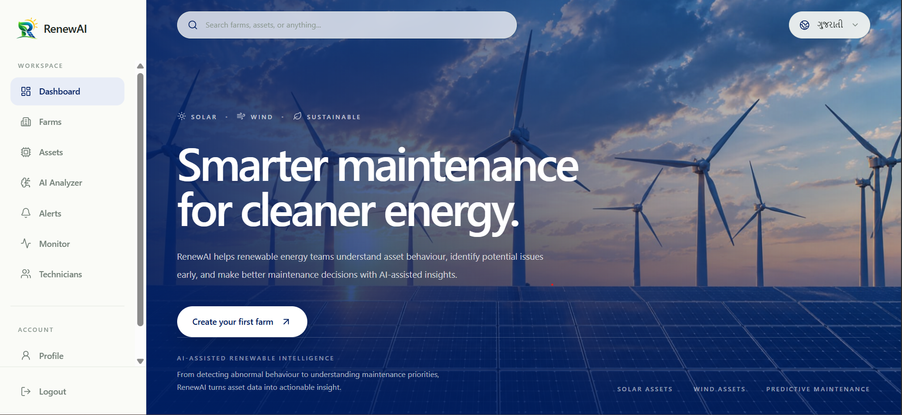
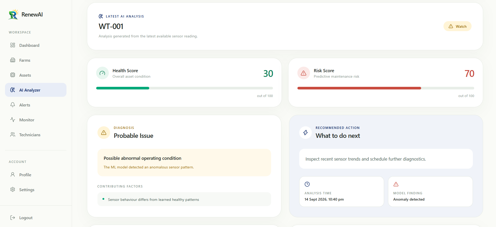
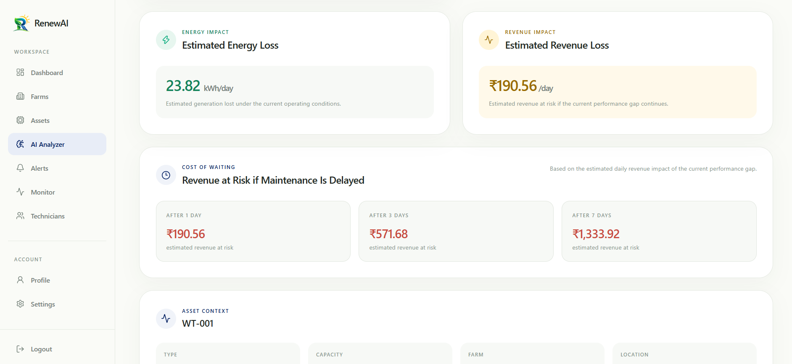
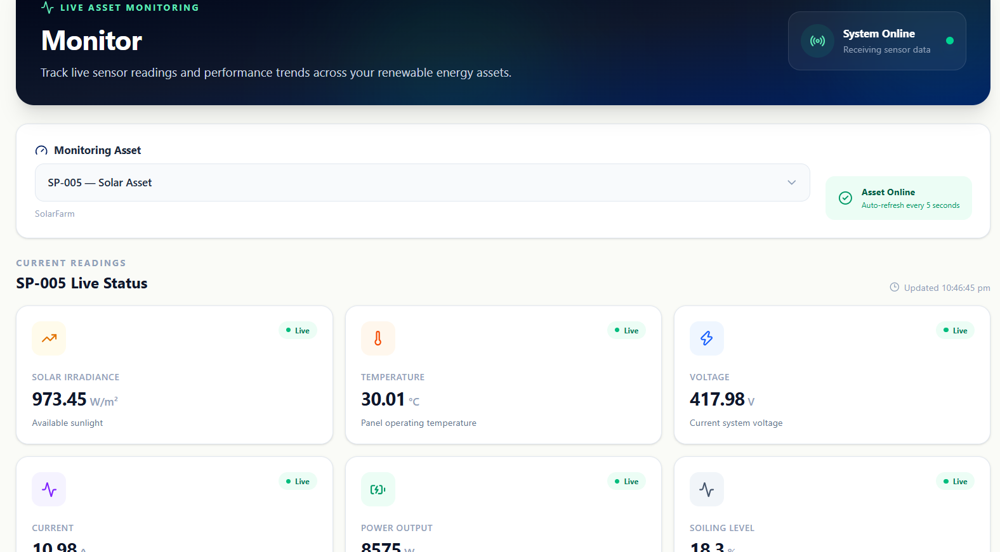
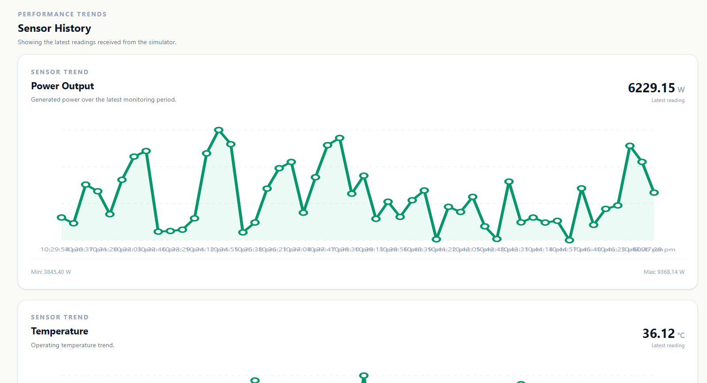
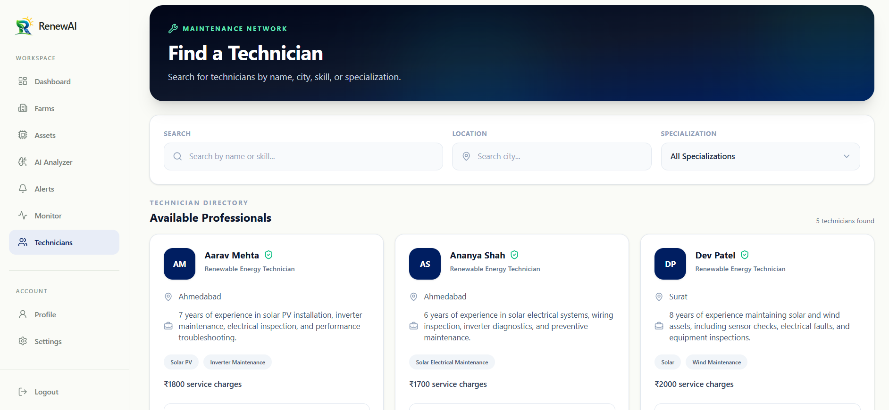
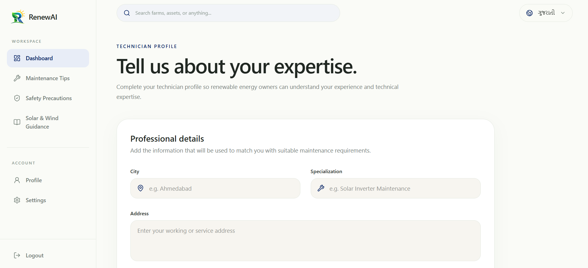
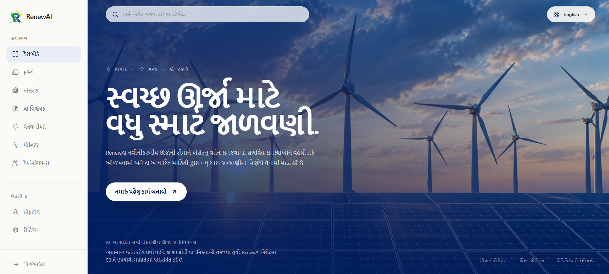

# ⚡ RenewAI

> **Predict the problem. Prevent the breakdown. Keep renewable energy moving.**

RenewAI is a predictive-maintenance platform for **solar and wind farms** that connects two people who usually end up solving the same problem separately — **the farmer who needs the issue fixed, and the technician who needs to know exactly what they're walking into.**

Instead of waiting for equipment to fail, RenewAI watches the data, spots early warning signs, estimates the **Cost of Waiting**, and helps the right technician take action.

---

## 📸 Project Screenshots


### Farm Owner Dashboard



### Asset Health & Risk Analysis using AI



### Estimated Loss Prediction



### Live Monitoring




### Technician Search



### Technician Dashboard



### English To Gujrati Translation




---

## 🌱 The Problem

A small anomaly in a renewable-energy asset can quietly become a very expensive problem.

Farmers often have to figure out:

- *Is this actually a problem?*
- *How serious is it?*
- *How much could I lose if I wait?*
- *Who can fix it?*

And technicians may arrive knowing **what** broke, but not enough about **what they are about to face**.

**RenewAI brings the whole loop together — Detect → Explain → Estimate → Assign → Fix.**

---

## ✨ What RenewAI Does

### For the Farmer

**AI-powered early detection**  
Analyses live sensor data from solar and wind assets using **Isolation Forest + engineering-based diagnosis rules**.

**Cost of Waiting**  
Don't just say *"there's a problem."* Show the farmer what waiting could cost through estimated **energy and revenue loss**.

**Alerts & Risk Status**  
Assets are classified as **Healthy, Watch, or At Risk**, so the farmer knows what needs attention first.

**Technician Directory**  
Find technicians by **city and specialization**, view their experience and charges, and assign the job directly.

**Live Monitoring**  
The dashboard keeps updating so the farmer can see the current state of their assets instead of relying on yesterday's data.

**English + Gujarati**  
Important information can be understood in the language that feels more natural to the user.

---

### For the Technician

**Technician Guidance**  
The technician doesn't just receive *"Asset is broken."*  
They get the **probable issue, contributing factors, and recommended action** before heading out.

**Technician Safety**  
Safety information is surfaced as part of the maintenance workflow, helping technicians prepare before interacting with equipment.

**Maintenance Jobs**  
See assigned jobs, update progress, add notes, and mark work as completed.

**Profile & Settings**  
Technicians can manage their profile, specialization, experience, location, and charges — making it easier for farmers to find the right person.

---

## The User Journey

### 👨‍🌾 Farmer

**Sign up → Add farm → Add assets → Monitor → Get alert → Understand the risk → Check Cost of Waiting → Find technician → Assign job → Track resolution**

### 👷 Technician

**Sign up → Set profile & specialization → Receive job → Review issue & guidance → Prepare safely → Visit asset → Update status → Add notes → Complete job**

So yeah, it's not *just another dashboard*.  
**The farmer gets a decision. The technician gets context. The asset gets attention before it becomes a bigger problem.**

---

## 🧠 How It Works

```text
Sensor Data
    ↓
Feature Engineering
    ↓
Isolation Forest Anomaly Detection
    ↓
Engineering-Based Diagnosis
    ↓
Risk + Health Score
    ↓
Energy / Revenue Loss Estimate
    ↓
Farmer Alert
    ↓
Technician Assignment
    ↓
Maintenance → Resolution
```

For **wind assets**, RenewAI looks at signals such as wind speed, rotor speed, vibration, temperature, current and power output.

For **solar assets**, it considers irradiance, temperature, voltage, current, power output and soiling-related signals.

The result is not just an anomaly score — it is translated into something a person can actually act on.

---

## Tech Stack

**Frontend**  
React · React Router · Tailwind CSS · Recharts · Lucide React

**Backend**  
FastAPI · SQLAlchemy · PostgreSQL · JWT Authentication · WebSockets

**ML & Intelligence**  
Python · NumPy · Pandas · Scikit-learn · Isolation Forest · Rule-based Diagnosis

**Architecture**  
`React UI → FastAPI → PostgreSQL`  
`                 ↘ ML / Diagnosis`

---

## 📁 Project Structure

```text
RenwAI/
│
├── backend/                              # FastAPI backend
│   ├── main.py                           # Application entry point & WebSocket
│   ├── database.py                       # Database connection & session
│   ├── models.py                         # SQLAlchemy database models
│   ├── schemas.py                        # Pydantic request/response schemas
│   ├── auth.py                            # Authentication & JWT handling
│   ├── diagnosis.py                      # Engineering-based fault diagnosis
│   ├── ml_analysis.py                    # Asset analysis & risk calculation
│   ├── ml_model.py                       # Anomaly detection / model logic
│   │
│   ├── routers/                          # API route modules
│   │   ├── users.py                      # Signup, login & user operations
│   │   ├── farms.py                      # Farm management
│   │   ├── assets.py                     # Solar & wind asset management
│   │   ├── sensors.py                    # Sensor readings
│   │   ├── analyses.py                   # Asset analysis & dashboard APIs
│   │   ├── technicians.py                # Technician profiles & directory
│   │   └── jobs.py                       # Maintenance job management
│   │
│   ├── routes/
│   │   └── translation.py                # English / Gujarati support
│   │
│   └── requirements.txt                  # Backend dependencies
│
├── database/
│   └── schema.sql                        # PostgreSQL database schema
│
├── frontend/                             # React + Vite frontend
│   ├── public/                           # Static assets
│   │
│   ├── src/
│   │   ├── components/                   # Reusable UI components
│   │   ├── pages/                        # Farmer & technician screens
│   │   ├── services/                     # Backend/API communication
│   │   ├── hooks/                        # Reusable React logic
│   │   ├── utils/                        # Frontend utilities
│   │   └── ...
│   │
│   ├── package.json                      # Frontend dependencies
│   ├── vite.config.*                     # Vite configuration
│   └── ...
│
├── ml-simulator/                         # Renewable sensor simulation
│   └── ...                               # Simulated solar/wind readings
│
├── openapi.json                          # API specification
├── .gitignore                            # Ignored files & secrets
└── README.md                             # Project documentation

```

---

## 🚀 Setup

### 1. Backend

```bash
cd backend
python -m venv venv
venv\Scripts\activate
pip install -r requirements.txt
uvicorn main:app --reload
```

### 2. Frontend

```bash
cd frontend
npm install
npm run dev
```

### 3. Start the Sensor Simulator

The simulator generates realistic **wind and solar sensor readings** and sends them to the backend, so you can see RenewAI's monitoring and analysis in action.

Open a **new terminal**:

```bash
cd ml-simulator
python simulate.py
```

### 4. Database

Create a PostgreSQL database and configure the required environment variables in the backend.

Once everything is running:

**Create → Simulate → Analyse → Monitor → Assign → Maintain.**

---

## 💡 Why RenewAI?

Because predictive maintenance should not stop at **"something looks wrong."**

It should answer:

> **What is wrong? How serious is it? What happens if I wait? Who can fix it? And how can they fix it safely?**

RenewAI turns raw renewable-energy data into **decisions, action, and safer maintenance.**

---

## Future Aspects

- Smarter asset-level failure prediction
- More detailed technician safety protocols
- Historical performance & maintenance analytics
- Richer multilingual support
- Automated technician recommendations
- More renewable asset types

---

## 👥 Team

Built with caffeine, debugging, questionable sleep schedules, and a slightly unhealthy obsession with making renewable energy smarter.

---

## License 📄

This project was created for **HackOut'26** as a student project focused on exploring technology for predictive maintenance in renewable energy.

You're welcome to explore and build on the project for learning and experimentation. 
If you reuse any part of our work or approach, we'd appreciate giving **Team ThirdDegree** credit.
